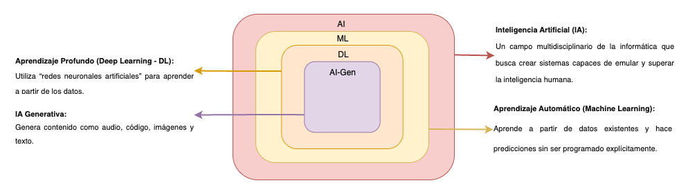
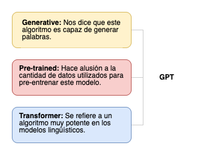

# Exactamente qué y (sobre todo) por qué ChatGPT

## ¿Exactamente qué? GPT

 Este diagrama es clave para entender el origen conceptual y tecnológico de modelos como *GPT*, y cómo encajan dentro del ecosistema de la inteligencia artificial. Vamos a analizarlo paso a paso, y luego te explico cómo encaja GPT dentro de este marco.

 **El presente gráfico representa una jerarquía concéntrica de las disciplinas involucradas:**



### *Inteligencia Artificial (AI):*

- Es el rectángulo más externo.
- Es el campo más amplio que abarca todo tipo de sistemas diseñados para emular o superar la inteligencia humana.
- Incluye desde reglas expertas, lógica difusa, sistemas simbólicos, hasta redes neuronales.

> **Nota:** GPT pertenece a este campo porque intenta imitar capacidades cognitivas humanas como el lenguaje, el razonamiento y la generación de texto.

### *Aprendizaje Automático (Machine Learning)*

- Subconjunto de la IA.
- Aquí ya no se programan reglas explícitas, sino que el sistema aprende patrones automáticamente a partir de datos.

> **Nota:** GPT también está dentro del ML, ya que aprende a partir de enormes volúmenes de texto para hacer predicciones (por ejemplo, la próxima palabra).

### *Aprendizaje Profundo (Deep Learning)*

- Subconjunto de ML basado en redes neuronales profundas.
- Utiliza arquitecturas como CNN, RNN, Transformers (¡como GPT!).

> **Nota:** GPT es un modelo de Deep Learning, ya que está construido con redes neuronales profundas tipo Transformer, entrenadas con aprendizaje supervisado y/o auto-supervisado.

### *IA Generativa (AI-Gen)*
- Subconjunto del Deep Learning, orientado a crear contenido nuevo: texto, imágenes, audio, código, etc.
- GPT, DALL·E, Midjourney, Stable Diffusion, etc., pertenecen a este espacio.

> **Nota:** GPT es un modelo de IA Generativa, porque genera texto a partir de una entrada. Aprende los patrones del lenguaje y genera texto coherente, creativo o informativo.

### *¿Cómo explica todo esto el origen de GPT?*
- GPT nace dentro del campo de la IA, pero no cualquier IA.
- Es un modelo de Deep Learning basado en Transformers, introducido por el paper “Attention Is All You Need” (2017).
- Fue entrenado con aprendizaje automático sobre grandes corpus de texto (web, libros, código, etc.).
- Su objetivo no es solo clasificar o predecir, sino generar texto nuevo y coherente, lo que lo ubica dentro de la IA Generativa.

### Entonces:

**GPT** significa Generative Pre-trained Transformer (Transformador Generativo Pre-entrenado). Una arquitectura de inteligencia artificial desarrollada por *OpenAI* que se especializa en generar texto y procesar lenguaje natural de manera altamente sofisticada.



Para adentrarnos en el tema iniciemos con una demo en Python para simular una interaccion con ChatGPT.

```python
import time
import sys

def typewriter_effect(text, delay=0.08):
    for char in text:
        sys.stdout.write(char)
        sys.stdout.flush()
        time.sleep(delay)
    print()

def main():
    while True:
        user_input = input("Enviar mensaje a ChatGPT: ")
        if user_input.lower() == 'hola':
            response = "¡Hola! ¿Cómo estás? ¿En qué te puedo ayudar hoy?"
            typewriter_effect(response)
            follow_up = input("Enviar mensaje a ChatGPT: ")
            if follow_up.lower() == 'cual es la capital de mexico':
                capital_response = (
                    "La capital de México es la Ciudad de México, también conocida como CDMX. "
                    "Es una de las ciudades más grandes y pobladas del mundo y también el centro "
                    "político, económico y cultural del país."
                )
                typewriter_effect(capital_response)
                thanks_follow_up = input("Enviar mensaje a ChatGPT: ")
                if thanks_follow_up.lower() == 'gracias':
                    thanks_response = (
                        "¡De nada! Si tienes más preguntas, no dudes en preguntar. "
                        "¡Estoy aquí para ayudarte!"
                    )
                    typewriter_effect(thanks_response)
        else:
            typewriter_effect("Si, las quesadillas llevan queso.")
            break

if __name__ == "__main__":
    main()
```

Este ejemplo simula una conversación sencilla con ChatGPT en la terminal usando respuestas contextuales encadenadas (mínimamente). El efecto máquina de escribir da una sensación más “humana”, más real por lo que simula superficialmente una experiencia de tipo humana, esto nos introduce a un nuevo concepto:

### Antropomorfismo

El antropomorfismo es una técnica literaria que asigna características humanas a entidades no humanas. En el contexto de la inteligencia artificial, esto se traduce en cómo los modelos pueden presentar resultados que parecen ‘tener emociones’ o ‘intenciones’, lo que explica las sensaciones escalofriantes que solemos sentir al interactuar con la IA. 

### ¿Es realmente inteligente?

Si inteligencia = razonar, entender, tener conciencia o intención. Entonces no, la IA no es realmente inteligente.

- No tiene conciencia, voluntad propia ni comprensión real.
- GPT, por ejemplo, no “sabe” lo que dice, solo predice qué palabras vienen después de otras basándose en estadísticas aprendidas.
- No tiene experiencias ni un modelo del mundo interno como los humanos.

Aclarando esto; entonces estudiemos su estructura y profundicemos en comó logra estas predicciones tan precisas que permiten entender lenguaje natural, resumir información, traducir idiomas, escribir código entre otros.

### La Estructura de los Modelos GPT

> **Prompt o entrada:** Cuando le das una entrada al modelo, esta se convierte en un vector numérico que representa cada palabra.

> **Procesamiento:** El modelo usa capas de auto-atención y feed-forward para analizar la entrada y predecir una palabra de salida basada en la secuencia previa.

> **Salida:** El modelo genera una palabra, luego usa esa palabra para predecir la siguiente, y así sucesivamente, generando una secuencia de texto completa.

